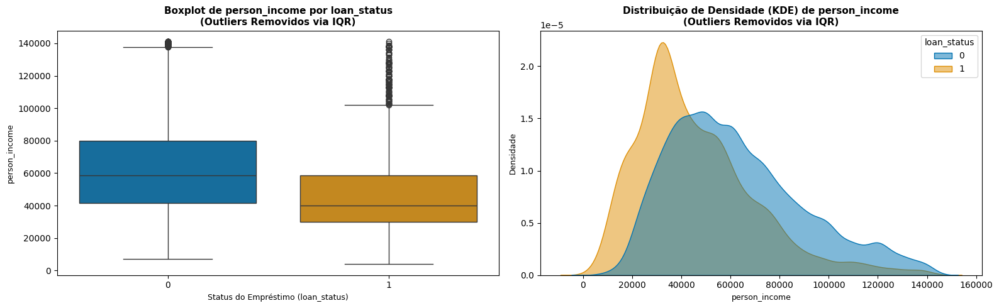
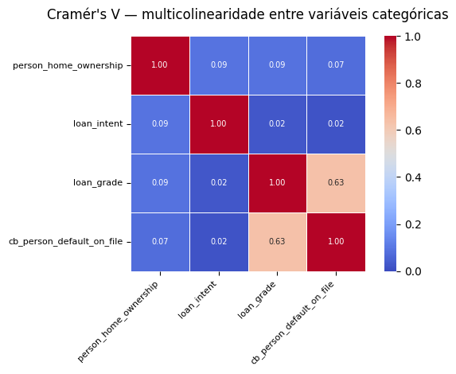
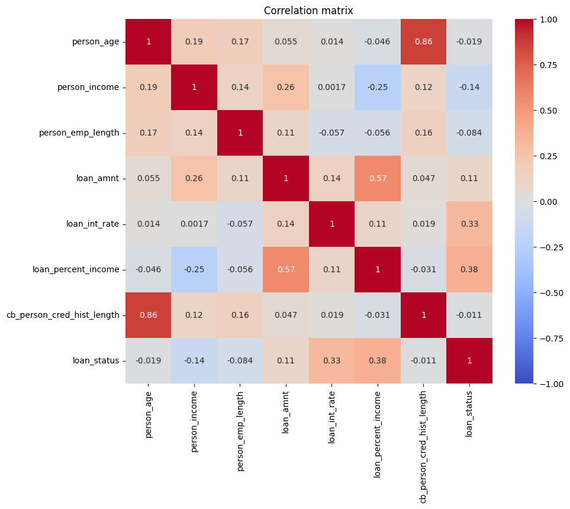
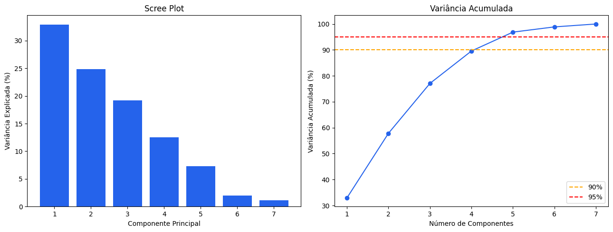
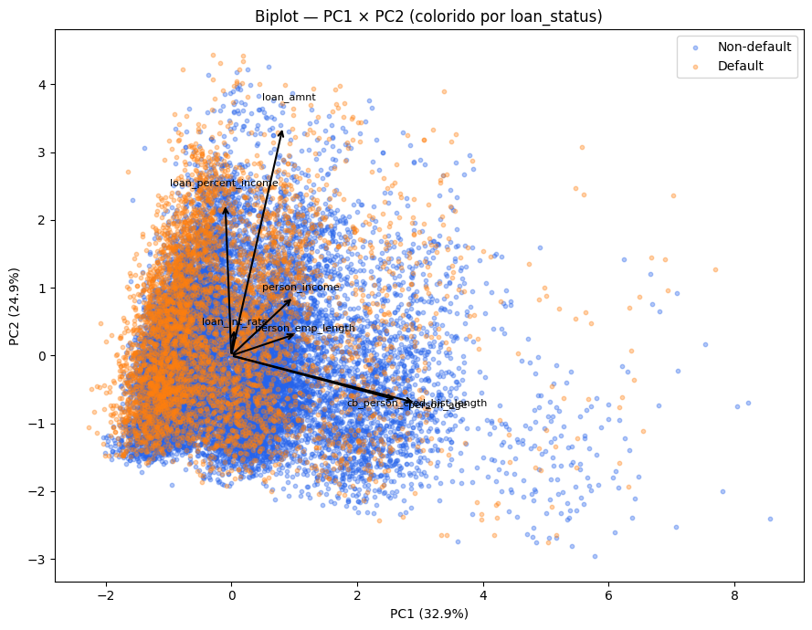
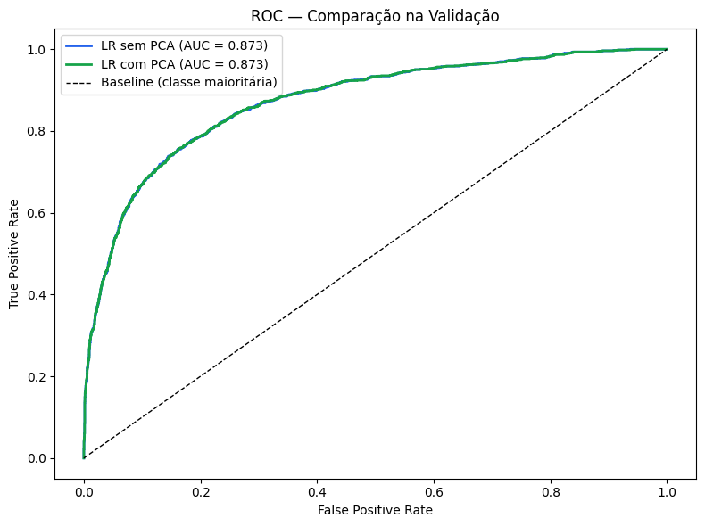
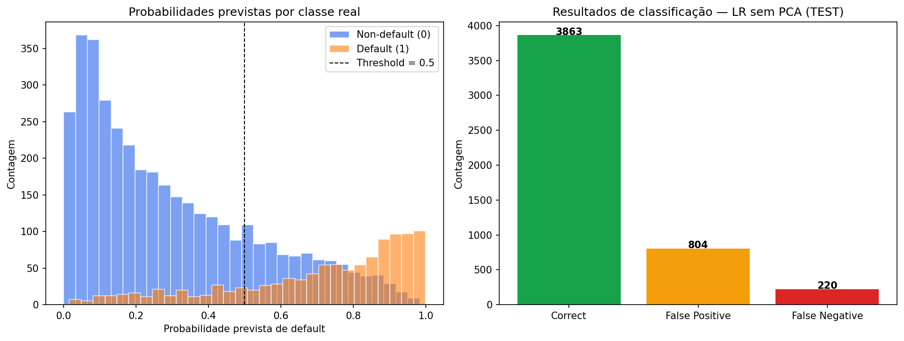
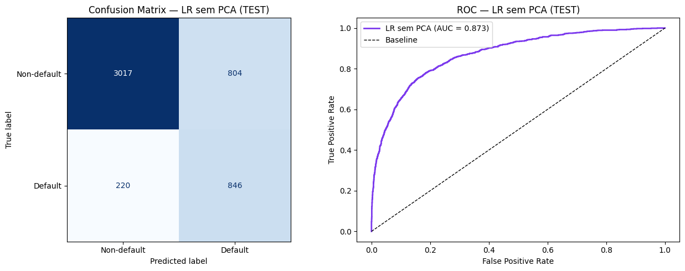

# Relatório de Projeto Final: Análise Exploratória, Regressão e Componentes Principais (PCA) para Modelagem de Risco de Crédito

**Autora:** Erika  
**Data:** Junho de 2026  
**Contexto Acadêmico:** Projeto de Avaliação de Data Science  

---

## Resumo Executivo
Este relatório apresenta o desenvolvimento completo de um pipeline preditivo de ponta a ponta voltado para a classificação de risco de crédito, determinando a probabilidade de incumprimento (*default*) de clientes. Com base nos dados fornecidos, projetou-se uma arquitetura analítica disciplinada pautada na reprodutibilidade. O documento detalha as etapas de divisão de dados, análise rigorosa de dados faltantes, análise exploratória univariada e bivariada, mitigação de multicolinearidade através de análises estatísticas, engenharia de atributos automatizada via pipelines do *scikit-learn*, avaliação do impacto prático da Análise de Componentes Principais (PCA) sob Regressão Logística e, por fim, uma auditoria de erros cometidos pelo modelo preditivo final.

---

## 1. Setup, Definição do Problema e Estratégia de Avaliação

### 1.1 Definição do Problema e Alvo de Negócio
A atividade consiste na modelagem preditiva supervisionada de classificação binária, em que o objetivo central é mapear se um proponente a crédito entrará em incumprimento financeiro, designado pela variável alvo `loan_status` (onde `1` denota *Default* / Incumprimento e `0` denota *Non-default* / Adimplência). Do ponto de vista de negócio, a correta triagem atua diretamente na saúde de carteira de crédito da instituição, balanceando a maximização de receitas por juros e a mitigação extrema de perdas por não pagamento.

### 1.2 Protocolo de Métricas de Avaliação
O conjunto de dados apresenta um desbalanceamento natural de classes (aproximadamente 78.2% de adimplentes para 21.8% de inadimplentes). Portanto, a métrica de Acurácia Global (*Accuracy*) torna-se um indicador frágil e potencialmente enganoso. Visando blindar o projeto contra interpretações parciais, definiu-se o seguinte protocolo de métricas:

* **Acurácia Balanceada (*Balanced Accuracy*):** Calculada como a média aritmética do *Recall* obtido em cada uma das classes de forma isolada. Garante que o desempenho do modelo na classe minoritária possua peso equivalente ao da majoritária.

$$Balanced\ Accuracy = \frac{Sensitivity + Specificity}{2}$$

Onde:

$Sensitivity$ (Sensibilidade ou *Recall* da Classe 1) é $\frac{TP}{TP + FN}$ e $Specificity$ (Especificidade ou *Recall* da Classe 0) é $\frac{TN}{TN + FP}$.
    
    
* **ROC-AUC (Área Sob a Curva ROC):** Fornece uma métrica agregada da capacidade de ordenação (*ranking*) de risco do modelo ao longo de todos os limiares (*thresholds*) de decisão possíveis, sendo imune a distorções causadas por desbalanceamentos de classe.
* **F1-Score (Focada na Classe 1):** Média harmônica entre Precisão e Cobertura (*Recall*) para a detecção de inadimplentes, penalizando assimetrias severas em qualquer uma das duas frentes.

$$F_1 = 2 \times \frac{Precision \times Recall}{Precision + Recall}$$

* **Trade-off Precisão vs. Cobertura (*Precision-Recall Trade-off*):** Uma métrica orientada ao impacto financeiro:
    * Um baixo *Recall* de Inadimplência gera **Falsos Negócios / Falsos Negativos** (aprovar o crédito de quem não vai pagar), gerando perdas diretas do capital emprestado.
    * Uma baixa *Precisão* de Inadimplência gera **Falsos Positivos** (recusar clientes adimplentes legítimos), ocasionando custo de oportunidade e fricção comercial.

    $$Precision = \frac{TP}{TP + FP}$$
    
    $$Recall = \frac{TP}{TP + FN}$$

    Onde:
    * **$TP$ (Verdadeiro Positivo):** Cliente inadimplente classificado corretamente como inadimplente.
    * **$TN$ (Verdadeiro Negativo):** Cliente adimplente classificado corretamente como adimplente.
    * **$FP$ (Falso Positivo):** Cliente adimplente classificado erroneamente como inadimplente (Custo de oportunidade).
    * **$FN$ (Falso Negativo):** Cliente inadimplente classificado erroneamente como adimplente (Perda direta de capital).

---

## 2. Particionamento dos Dados e Garantia de Reprodutibilidade

Para impedir qualquer forma de vazamento de dados (*data leakage*) e assegurar a máxima integridade científica da avaliação, o conjunto original foi fragmentado em três partições distintas e estanques. A semente aleatória (`RANDOM_STATE = 42`) e o critério de estratificação pela variável alvo foram aplicados uniformemente em todas as divisões.

### 2.1 Volumetria e Distribuição das Partições
* **Treino (Train Set - 70%):** Composto por $22.806$ observações, utilizado de forma exclusiva para a calibração de parâmetros, cálculo de medianas de imputação e ajustes de escalas dos transformadores.
    * *Classe 0 (Adimplente):* $17.831$ registros ($78.2\%$)
    * *Classe 1 (Inadimplente):* $4.975$ registros ($21.8\%$)
* **Validação (Validation Set - 15%):** Composto por $4.888$ observações, extraído de forma embutida a fim de balizar escolhas de modelagem, hiperparâmetros e análise comparativa da inclusão ou exclusão de componentes do PCA.
* **Teste Holdout (Test Set - 15%):** Composto por $4.887$ observações (`df_validation.csv`), totalmente isolado ao longo do desenvolvimento analítico, servindo unicamente para auditoria final do modelo selecionado.

---

## 3. Explicação e Tratamento de Dados Ausentes (*Missing Data Analysis*)

Ao invés de adotar estratégias genéricas de imputação imediata, foi conduzida uma análise orientada à teoria de mecanismos de perda de Donald Rubin, investigando as razões de omissão nas variáveis `loan_int_rate` (Taxa de Juros, 9.65% de dados faltantes) e `person_emp_length` (Tempo de Emprego, 2.80% de dados faltantes).

### 3.1 Mecanismos e Justificativas de Negócio
1. **`person_emp_length` (Mecanismo MAR — *Missing at Random*):** A hipótese de que a ausência de dados ocorre de forma completamente aleatória (MCAR) foi rejeitada por testes estatísticos de hipótese ($p = 0.0000$). Evidenciou-se que a omissão é sistemática e previsível através das variáveis observadas de renda anual (`person_income`) e do tipo de propriedade de habitação (`person_home_ownership`). Como a ausência segue o perfil financeiro e patrimonial do proponente, a imputação cega pela média global geraria sérias distorções socioeconômicas, validando a estratégia de isolar a imputação pela mediana condicional agrupada.
2. **`loan_int_rate` (Mecanismo MCAR com Suspeita de MNAR):** Os testes estatísticos de associação e independência não encontraram relações significativas com as demais variáveis observadas ($p \ge 0.05$), impossibilitando a rejeição da hipótese de dados faltantes completamente aleatórios (MCAR). Todavia, do ponto de vista de negócio, mantém-se a ressalva analítica de um mecanismo MNAR (*Missing Not at Random*), onde a própria ausência da taxa de juros pode estar vinculada a critérios internos não indexados no dataset (como propostas pré-rejeitadas na triagem inicial). À luz dos dados, a estratégia de imputação pela mediana agrupada por `loan_grade` foi mantida para preservar a consistência e a política de precificação financeira institucional, sem distorcer a variância global da variável.

### 3.2 Estratégia de Imputação Condicional Customizada
Para capturar essa dependência de negócio, construiu-se um imputador condicional customizado integrado ao Pipeline final:
* Para `person_emp_length`, a imputação condicional de nulos dá-se pela mediana do tempo de emprego calculada através de faixas etárias do cliente. Essa abordagem justifica-se pelo fato de as variáveis explicativas reais da ausência (`person_income` e `person_home_ownership`) possuírem alta granularidade e dispersão categórica/numérica. Agrupar os dados diretamente por elas pulverizaria o dataset em subgrupos excessivamente pequenos ou vazios, inviabilizando uma estimativa consistente. Assim, a faixa etária atua como uma variável proxy agregadora estável, que contorna a restrição de granularidade e preserva a coerência socioeconômica do perfil.
* Para `loan_int_rate`, a omissão é resolvida utilizando a **mediana da taxa de juros agrupada pela classe de risco do empréstimo (`loan_grade`)**, preservando a coerência financeira e a variância natural da precificação.

---

## 4. Análise Exploratória Univariada, Bivariada e Regras de Negócio

A análise das distribuições revelou anomalias severas e ruídos operacionais que demandaram limpeza via regras de negócio explícitas antes de qualquer processamento estatístico.

### 4.1 Identificação de Inconsistências
* **Anomalia de Idade (`person_age`):** Identificação de registros contendo idades impossíveis (ex: proponentes com mais de 120 e 140 anos de idade).
* **Anomalia de Tempo de Emprego (`person_emp_length`):** Casos isolados apresentando tempo de emprego superior a 100 anos.

*Tratamento:* Em concordância com as melhores práticas de ciência de dados, estas inconsistências biográficas e de mercado foram convertidas para valores nulos (`NaN`) para que o Pipeline de imputação condicional as tratasse de forma estatisticamente íntegra, eliminando o viés do ruído.

### 4.2 Comportamentos Bivariados e Insights de Negócio
* **Renda Anual (`person_income`):** Exibe uma assimetria à direita extrema (longa cauda de alta renda). O comportamento bivariado evidencia que o risco de inadimplência decai acentuadamente conforme a renda se eleva, o que justifica a aplicação da transformação logarítmica (`np.log1p`) para estabilizar a variância e aproximar a distribuição de uma Gaussiana.



* **Razão do Empréstimo sobre a Renda (`loan_percent_income`):** Esta métrica demonstrou ser um dos preditores mais potentes do ecossistema. Proponentes cujo valor da parcela compromete mais de 30% a 40% da renda anual líquida apresentam taxas exponenciais de inadimplência, validando o impacto do superendividamento na capacidade de pagamento.


---

## 5. Análise de Correlação e Multicolinearidade

A presença de redundância, associações espúrias e dependência linear entre os preditores foi avaliada por meio de três abordagens estatísticas.

### 5.1 Associação Categórica via V de Cramer
O mapeamento de associações categóricas revelou um coeficiente criticamente elevado entre `loan_grade` (grau de risco do empréstimo) e `cb_person_default_on_file` (histórico de inadimplência registrado). O insight de negócio esclarece que a variável `loan_grade` já é calculada incorporando o histórico de default passado como um de seus principais pilares conceituais. Manter ambas as variáveis introduziria uma multicolinearidade prejudicial à interpretabilidade dos coeficientes. Como `loan_grade` provou ser uma variável de maior riqueza informativa (visto que agrega juros, scores e comportamento macroeconômico), optou-se pela desclassificação e exclusão de `cb_person_default_on_file`.




### 5.2 Correlação de Pearson
Para mensurar a força e a direção das relações lineares entre os atributos numéricos do dataset, calculou-se a matriz de correlação de Pearson. O mapeamento revelou uma forte dependência linear entre as variáveis de idade do cliente (`person_age`) e o tempo de histórico de crédito ativo (`cb_person_cred_hist_length`), apresentando um coeficiente de associação elevado ($r \approx 0.85$). 

Do ponto de vista estatístico, essa relação indica redundância direta de dados (co-linearidade), uma vez que o tempo de histórico de crédito é limitado e impulsionado pelo avanço cronológico da idade do indivíduo. Modelos lineares expostos a essa redundância sofrem de inflação de variância nos coeficientes, tornando as estimativas de pesos instáveis.




### 5.3 Fator de Inflação da Variância (VIF)
A tabela VIF calculada nas variáveis numéricas brutas do conjunto de treinamento expôs problemas severos de colinearidade:

| Variável Numérica | VIF Calculado | Status de Atenção / Ação |
| :--- | :--- | :--- |
| `person_age` | **27.36** | Crítico (Elevada colinearidade com o tempo de histórico de crédito) |
| `loan_int_rate` | **10.57** | Crítico (Ligação direta com o grau de risco atribuído) |
| `cb_person_cred_hist_length` | 7.26 | Moderado |
| `loan_percent_income` | 6.91 | Moderado (Vinculação matemática ao valor do empréstimo e renda) |
| `loan_amnt` | 6.84 | Moderado |


Estes resultados forneceram a fundamentação teórica necessária para o desenho do pipeline de engenharia de atributos: a necessidade de estabilização de escala por meio de algoritmos baseados em estatísticas.

---

## 6. Arquitetura do Pipeline de Processamento Automatizado

Com o intuito de mitigar riscos de vazamento e permitir a reprodutibilidade em produção, estruturou-se um pipeline do *scikit-learn* automatizado utilizando a biblioteca `dill` para encapsular transformadores customizados.

### 6.1 Estrutura de Transformação por Tipo de Atributo
* **Atributos Numéricos:**
    * *Tratamento de Nulos:* Aplicação do `ConditionalMedianImputer` customizado.
    * *Tratamento de Outliers:* Substituição do *StandardScaler* tradicional pelo **`RobustScaler`**. Esta decisão fundamenta-se no fato de o `RobustScaler` utilizar a mediana e o intervalo interquartil (IQR) para a padronização, impedindo que *outliers* legítimos de grandes fortunas ou empréstimos corporativos desloquem e distorçam severamente a escala das variáveis.
* **Atributos Categóricos:**
    * *Variáveis Nominais (`person_home_ownership`, `loan_intent`):* Codificadas via *One-Hot Encoding*, descartando a primeira categoria (`drop='first'`) para blindar o modelo linear contra a armadilha da multicolinearidade perfeita de variáveis dummy.
    * *Variáveis Ordinais (`loan_grade`):* Codificadas via *OrdinalEncoder*, mapeando as classes de risco de forma estritamente sequencial (`A` a `G`), preservando a hierarquia de risco natural estabelecida pelas políticas de crédito.

---

## 7. Análise de Componentes Principais (PCA)

### 7.1 Estrutura Numérica e Variância Explicada pelo PCA

Ao realizar a análise de componentes principais sobre as *features* numéricas escaladas, observou-se a distribuição da variância explicada pelos componentes. A tabela abaixo detalha a contribuição individual e acumulada dos componentes:

| Componente | Variância Explicada (%) | Acumulada (%) |
| :--- | :---: | :---: |
| PC1 | 32.95 | 32.95 |
| PC2 | 24.90 | 57.84 |
| PC3 | 19.24 | 77.08 |
| PC4 | 12.49 | 89.57 |
| PC5 | 7.29 | 96.86 |



Foi selecionada a retenção destes **5 Componentes Principais** para a etapa de modelagem, uma vez que estes retêm aproximadamente **96.86%** da variância total do conjunto de dados numéricos. O gráfico de *scree plot* e variância acumulada acima evidencia como o espaço informacional se distribui, confirmando a robustez da cobertura de variância obtida com esta seleção.



 O gráfico de *biplot* gerado nesta fase evidenciou uma sobreposição significativa na projeção das classes, sinalizando que a separabilidade linear no espaço reduzido oferece desafios complexos para o classificador.

## 8. Modelagem

### 8.1 Protocolo de Treinamento
Seguindo o roteiro estabelecido no projeto, os modelos foram configurados da seguinte forma para avaliação:

* **Baseline:** Utiliza o `DummyClassifier` com a estratégia `most_frequent`, estabelecendo o limite inferior de desempenho baseado na classe majoritária do treino.
* **Regressão Logística (Sem PCA):** Modelo treinado com o conjunto completo de *features* processadas, utilizando regularização Ridge (`L2`) e ajuste de pesos (`class_weight='balanced'`) para mitigar o desbalanceamento das classes.
* **Regressão Logística (Com PCA):** Modelo treinado sob as mesmas premissas de regularização e balanceamento, utilizando como *input* apenas os 5 componentes principais derivados anteriormente.

## 9. Comparação de Modelos

### 9.1 Painel Comparativo de Resultados
A tabela abaixo consolida o desempenho obtido pelos modelos na partição de validação:

| Métrica Examinada | Baseline (Classe Frequente) | LR (Sem PCA) | LR (Com PCA) |
| :--- | :---: | :---: | :---: |
| **Acurácia Global** | 0.7817 | 0.7901 | 0.7901 |
| **Acurácia Balanceada** | 0.5000 | 0.7925 | 0.7931 |
| **ROC-AUC Score** | NaN | 0.8725 | 0.8726 |
| **F1-Score (Classe 1)** | 0.0000 | 0.6236 | 0.6242 |
| **Precisão (Classe 1)** | 0.0000 | 0.5124 | 0.5123 |
| **Recall (Classe 1)** | 0.0000 | 0.7966 | 0.7985 |


### 9.2 Conclusões e Seleção do Modelo Campeão

A análise comparativa demonstrou que a aplicação da técnica de redução de dimensionalidade por **Principal Component Analysis (PCA)** resultou em desempenho estatisticamente equivalente ao obtido pelo modelo treinado com o conjunto completo de variáveis originais, apresentando apenas variações marginais nos principais indicadores de desempenho.




### 9.3 Justificativa para a Seleção do Modelo

Embora o PCA tenha demonstrado elevada capacidade de preservação da estrutura informacional do conjunto de dados, retendo aproximadamente **96% da variância total**, a **Regressão Logística sem PCA** foi selecionada como modelo final para implantação e avaliação no conjunto de teste holdout.

A decisão foi fundamentada nos seguintes princípios de governança e boas práticas em Ciência de Dados:

* **Transparência e Interpretabilidade**

    A utilização das variáveis originais permite a interpretação direta dos coeficientes estimados pela Regressão Logística, possibilitando identificar a contribuição individual de cada variável para a probabilidade de inadimplência.

    Essa característica é particularmente relevante em aplicações de crédito, nas quais requisitos regulatórios e operacionais frequentemente demandam elevado grau de explicabilidade das decisões automatizadas.

* **Parcimônia e Robustez Operacional**

    A remoção da etapa de redução de dimensionalidade simplifica o pipeline de processamento, reduzindo a quantidade de transformações necessárias entre a entrada dos dados e a geração das previsões.

    Pipelines menos complexos tendem a apresentar maior facilidade de manutenção, auditoria, reprodutibilidade e monitoramento em ambientes de produção.

* **Eficiência Marginal da Redução de Dimensionalidade**

    Apesar de o PCA ter reduzido a dimensionalidade do problema sem perda substancial de informação, os ganhos observados em desempenho foram desprezíveis. Considerando que a quantidade de variáveis originais já se encontrava em um patamar plenamente administrável para a Regressão Logística, a introdução de componentes principais não produziu benefícios suficientes para justificar a perda de interpretabilidade associada às variáveis latentes.

### 9.4 Decisão Final

Diante da equivalência de desempenho observada entre as abordagens avaliadas, optou-se pela seleção da **Regressão Logística sem PCA** como modelo campeão.

Essa escolha privilegia a simplicidade, a transparência e a interpretabilidade do sistema, mantendo praticamente o mesmo nível de desempenho preditivo obtido pela versão com redução de dimensionalidade. A decisão está alinhada ao princípio da parcimônia (*Occam's Razor*), segundo o qual, entre modelos com desempenho semelhante, deve-se preferir aquele que apresenta menor complexidade estrutural e maior facilidade de interpretação.


## 10. Resultados Finais no Conjunto de Teste Holdout

Em cumprimento estrito aos preceitos de governança em Data Science, o modelo vencedor (**Regressão Logística Sem PCA**) foi avaliado uma única e definitiva vez na partição oculta de teste.

### 10.1 Relatório de Classificação Final (*Classification Report*)

```text
=== MODELO VENCEDOR: REGRESSÃO LOGÍSTICA SEM PCA — TEST SET ===

  Accuracy:              0.7905
  Balanced Accuracy:     0.7916
  ROC-AUC Score:         0.8726
  F1-Score (Classe 1):   0.6230
  Precision (Classe 1):  0.5127
  Recall (Classe 1):     0.7936

                precision    recall  f1-score   support

 Non-default       0.93      0.79      0.85      3821
     Default       0.51      0.79      0.62      1066

    accuracy                             0.79      4887
   macro avg       0.72      0.79      0.74      4887
weighted avg       0.84      0.79      0.80      4887
```


A estabilidade observada entre os resultados obtidos durante a validação cruzada e aqueles verificados na partição de teste holdout fornece forte evidência empírica da capacidade de generalização do modelo. Além disso, a consistência das métricas sugere que o pipeline de pré-processamento e modelagem foi construído de forma adequada, minimizando riscos de vazamento de dados (*data leakage*) e reduzindo a probabilidade de sobreajuste (*overfitting*).

### 10.2 Análise da Distribuição das Probabilidades e Ponto de Corte

A figura abaixo apresenta a distribuição das probabilidades previstas pelo modelo para cada classe real, bem como o ponto de decisão adotado (threshold = 0.5).



Observa-se que o modelo apresenta boa separação geral entre as classes, com concentrações distintas de probabilidades para clientes adimplentes e inadimplentes. No entanto, verifica-se a existência de uma região de sobreposição entre aproximadamente 0.3 e 0.7, indicando que parte das observações não é perfeitamente separável pela fronteira de decisão aprendida.

Essa sobreposição explica diretamente a ocorrência simultânea de falsos positivos e falsos negativos, uma vez que o threshold fixo de 0.5 intercepta uma região de incerteza do modelo.

Adicionalmente, observa-se que a distribuição das probabilidades para a classe negativa (Non-default) é mais concentrada em valores baixos, enquanto a classe positiva (Default) apresenta maior dispersão em valores elevados, evidenciando a capacidade discriminativa geral do modelo.

---

## 11. Análise de Erros (*Error Analysis*) e Limitações do Modelo

A investigação dos erros do classificador no conjunto de teste baseou-se nos resultados da matriz de confusão e no desempenho observado durante a avaliação final do modelo de Regressão Logística. A análise dos erros permite compreender as limitações da fronteira de decisão aprendida pelo algoritmo e identificar oportunidades de aprimoramento para futuras versões do sistema preditivo.

### 11.1 Diagnóstico de Falsos Positivos

A matriz de confusão do conjunto de teste quantifica a incidência de **Falsos Positivos**, correspondentes a proponentes classificados como inadimplentes pelo modelo, mas que efetivamente permaneceram adimplentes.



A ocorrência de Falsos Positivos impacta diretamente a métrica de **Precision** da classe positiva, refletindo situações em que o modelo sinaliza risco de inadimplência para clientes que não apresentaram comportamento inadimplente.

Esse comportamento sugere uma tendência mais conservadora da fronteira de decisão, priorizando a identificação de potenciais inadimplentes mesmo ao custo de aumentar o número de classificações incorretas entre clientes adimplentes. Em contextos de concessão de crédito, esse tipo de erro pode resultar na rejeição de clientes potencialmente elegíveis para aprovação.

---

### 11.2 Diagnóstico de Falsos Negativos

A matriz de confusão também evidencia a presença de **Falsos Negativos**, casos em que o valor real corresponde à classe inadimplente (*Default = 1*), mas a previsão do modelo indica adimplência (*Non-Default = 0*).


A existência desses registros demonstra que a separação entre as classes não é perfeita no espaço de atributos disponível. Nesses casos, as variáveis fornecidas ao modelo não foram suficientes para deslocar a observação para o lado correto da fronteira de decisão.

Do ponto de vista operacional, os Falsos Negativos representam o tipo de erro mais crítico, pois correspondem à aprovação potencial de clientes que efetivamente apresentariam inadimplência. A presença desses erros sugere que determinados padrões de risco não estão sendo totalmente capturados pela estrutura atual do modelo.

---

### 11.3 Limitações Intrínsecas do Modelo Linear

#### Arquitetura Linear

A Regressão Logística estabelece uma fronteira de decisão linear para separar as classes de interesse. Embora essa abordagem apresente vantagens significativas em termos de interpretabilidade, simplicidade e estabilidade, ela impõe restrições à capacidade de representação de padrões mais complexos presentes nos dados.

Os resultados obtidos na avaliação final indicam que existe sobreposição entre as classes de adimplência e inadimplência no espaço de atributos, reduzindo a eficácia de uma separação puramente linear.

#### Complexidade dos Dados

As métricas finais obtidas no conjunto de teste demonstram que o modelo alcança boa capacidade preditiva, mas ainda encontra limitações na discriminação completa entre as classes.

Esse comportamento sugere que parte dos padrões associados à inadimplência pode depender de relações não lineares, interações entre variáveis ou efeitos de limiar que não são adequadamente representados pela formulação da Regressão Logística. Consequentemente, a capacidade de generalização do modelo fica limitada pela própria estrutura linear adotada.

---

### Considerações Finais

A análise dos erros evidencia que a Regressão Logística constitui uma solução robusta e interpretável para o problema de previsão de inadimplência, apresentando desempenho consistente no conjunto de teste e adequada capacidade de generalização.

Entretanto, a presença de Falsos Positivos e Falsos Negativos, bem como a sobreposição observada entre as classes, indica que parte da informação presente nos dados não é plenamente capturada por uma fronteira de decisão linear.

Como continuidade natural deste trabalho, recomenda-se a investigação de algoritmos capazes de modelar relações não lineares e interações complexas entre variáveis, tais como Random Forest, Gradient Boosting e XGBoost. A comparação entre essas abordagens e a Regressão Logística poderá determinar se o ganho de capacidade preditiva justifica o aumento da complexidade e a redução da interpretabilidade do modelo.


---